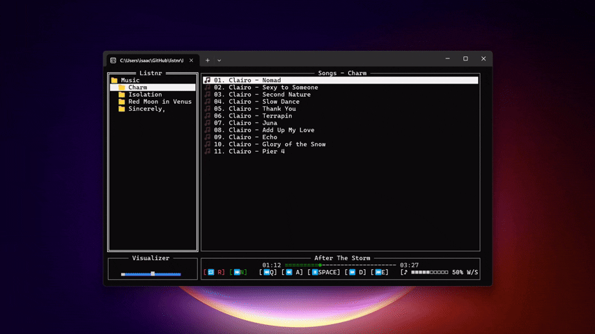

# Listnr - Terminal Music Player

A modern, modular terminal-based music player written in Go.



## Features

- 🎵 Support for MP3, WAV, FLAC, OGG, M4A formats
- 📁 Directory-based music library browsing
- ⚡ Real-time playback controls
- 🎛️ Volume control with visual feedback
- ⌨️ Vim-inspired keyboard shortcuts
- 🎨 Clean, responsive TUI interface
- 🎀 Audio visualizer

## Architecture

```
listnr/
├── cmd/listnr/          # Application entry point
├── internal/
│   ├── audio/           # Audio engine (decoding, playback)
│   ├── library/         # Music library management
│   ├── config/          # Configuration handling
│   ├── ui/              # Terminal user interface
│   │   └── components/  # Reusable UI components
│   └── events/          # Event system for component communication
```

## Installation

```bash
git clone https://github.com/sammwyy/listnr
cd listnr
go build ./cmd/listnr
./listnr
```

## Usage

### Navigation
- `ESC`: Close app.
- `←/→`: Navigate between sidebar and song list.
- `↑/↓`: Navigate list items,

### Playback
- `SPACE`: Play/pause.
- `A/D`: Seek backward/forward 5 seconds.
- `Q/E`: Previous/next song.
- `W/A`: Volume up/down.
- `R`: Toggle repeat mode.
- `N`: Toggle autoplay mode.

### Configuration

Configuration file is automatically created at `~/.config/listnr.json`:

```json
{
  "music_routes": ["/home/user/Music"],
  "volume": 0.5,
  "last_path": "",
  "autoplay_enabled": true,
  "repeat_mode": false
}
```